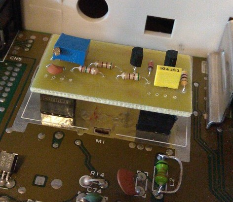
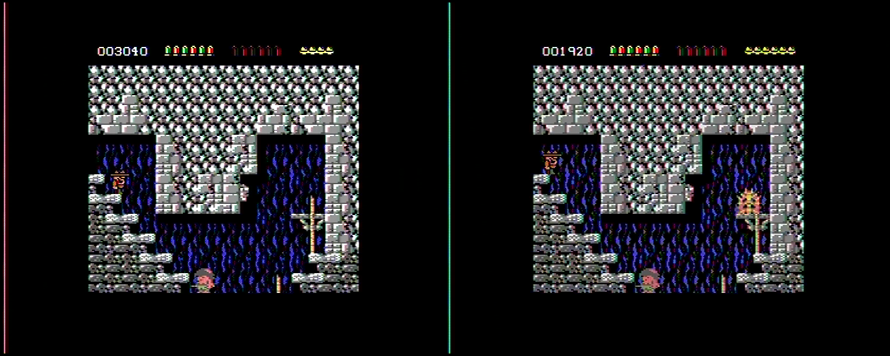

# ByeByeModulator
Modulator replacement for Commodore 64. The idea of this small board is to improve picture quality by removing noise that is caused by an RF modulator and its old electronic components. Including capacitors that can't be accessed easily for replacement, without desoldering a modulator first.  
This board is designed for, and tested with **250469 rev. B motherboard**. Do **NOT** even attempt to install it in other motherboards i.e. the one with 656x VIC-II chip. I'm not responsible for any damage.

## Board
It is a single sided, DIY friendly board.  
[Schematic](ByeByeModulator-schematic.pdf)  
[Back side for print](ByeByeModulator-board.png)  
  

## Results
Before & after
  
  
  
  
  

What I personally like about result is: rich colors (mostly yellow and green), not over-bright, and much cleaner text in the BASIC. There is some weird "wave" pattern going on, that I tried to fix by shortening L2 on C64 motherboard, it helped a bit.

## Space for improvement (aka work in progress)
If you have any idea how to improve this board, but at the same time keep it as simple as possible - feel free to fork this repository.

Thanks to aniol @ [c64scene.pl](http://www.c64scene.pl).
